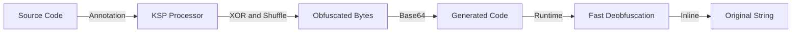

# String Obfuscator 🔒

[](https://jitpack.io/#Ealireza/StringObfuscator)
[](https://kotlinlang.org)
[](https://github.com/google/ksp)
[](https://developer.android.com)
[](LICENSE)

**Ultra-fast, compile-time string obfuscation for Android/Kotlin using KSP (Kotlin Symbol Processing).**

Protect your sensitive strings (API keys, secrets, tokens) from reverse engineering with zero runtime overhead!

---

## ✨ Features

- 🚀 **Compile-time obfuscation** - Strings encrypted during build, not at runtime
- 🔐 **Multi-layer security** - XOR encryption + bit shuffling + Base64 encoding
- ⚡ **Zero runtime overhead** - Optimized inline deobfuscation (~100ns)
- 🎯 **Simple API** - Just add `@StringObfuscate` annotation
- 📦 **Works on classes, objects, data classes** - Finds all string members automatically
- 🛡️ **ProGuard/R8 compatible** - Plays nice with code minification

---

## 📦 Installation

### Step 1: Add JitPack repository

**In your root `settings.gradle.kts`:**
```kotlin
dependencyResolutionManagement {
    repositoriesMode.set(RepositoriesMode.FAIL_ON_PROJECT_REPOS)
    repositories {
        google()
        mavenCentral()
        maven { url = uri("https://jitpack.io") }
    }
}
```

**Or in root `build.gradle.kts`:**
```kotlin
allprojects {
    repositories {
        google()
        mavenCentral()
        maven { url = uri("https://jitpack.io") }
    }
}
```

### Step 2: Add KSP plugin

**In your root `build.gradle.kts`:**
```kotlin
plugins {
    id("com.google.devtools.ksp") version "1.9.22-1.0.17" apply false
}
```

### Step 3: Add dependencies

**In your app's `build.gradle.kts`:**
```kotlin
plugins {
    id("com.android.application")
    kotlin("android")
    id("com.google.devtools.ksp")
}

dependencies {
    // String Obfuscator
    implementation("com.github.Ealireza.StringObfuscator:annotation:1.0.0")
    implementation("com.github.Ealireza.StringObfuscator:runtime:1.0.0")
    ksp("com.github.Ealireza.StringObfuscator:processor:1.0.0")
}
```

**That's it!** ✅ You're ready to use String Obfuscator.

---

## 🚀 Quick Start

### 1️⃣ Annotate your secrets

```kotlin
import com.obfuscate.annotation.StringObfuscate

@StringObfuscate
object ApiConfig {
    const val API_KEY = "your_api_key_here_example_12345"
    const val API_SECRET = "your_secret_key_here_example_xyz"
    const val BASE_URL = "https://api.example.com/v2"
}
```

### 2️⃣ Build your project

```bash
./gradlew build
```

KSP automatically generates `ApiConfigObfuscated` class.

### 3️⃣ Use obfuscated strings

```kotlin
class MainActivity : AppCompatActivity() {
    override fun onCreate(savedInstanceState: Bundle?) {
        super.onCreate(savedInstanceState)

        // ✅ Use obfuscated strings (automatically deobfuscated at runtime)
        val apiKey = ApiConfigObfuscated.getApiKey()
        val apiSecret = ApiConfigObfuscated.getApiSecret()
        val baseUrl = ApiConfigObfuscated.getBaseUrl()

        // Use in your API client
        retrofitClient.setApiKey(apiKey)
    }
}
```

---

## 📖 How It Works



1. **Annotation**: Mark classes with `@StringObfuscate`
2. **Processing**: KSP finds all `String` properties at compile time
3. **Obfuscation**:
   - XOR encryption with random key per string
   - Bit shuffling for additional entropy
   - Base64 encoding for storage
4. **Code Generation**: Creates `*Obfuscated` object with getter methods
5. **Runtime**: Fast inline deobfuscation when accessing values

---

## 🎯 Supported Types

Works on **all Kotlin types** with string properties:

```kotlin
// ✅ Object
@StringObfuscate
object ApiConfig {
    const val API_KEY = "key123"
}
// Usage: ApiConfigObfuscated.getApiKey()

// ✅ Class
@StringObfuscate
class UserCredentials {
    val username = "admin"
    val password = "pass123"
}
// Usage: UserCredentialsObfuscated.getUsername()

// ✅ Data Class
@StringObfuscate
data class DatabaseConfig(
    val host: String = "db.example.com",
    val password: String = "db_pass"
)
// Usage: DatabaseConfigObfuscated.getHost()

// ✅ Companion Object
class MyService {
    @StringObfuscate
    companion object {
        const val SECRET = "secret123"
    }
}
// Usage: MyService.CompanionObfuscated.getSecret()
```

---

## ⚡ Performance

| Operation | Time | Notes |
|-----------|------|-------|
| **Obfuscation** | 0ms runtime | Happens at compile-time |
| **Deobfuscation** | ~100ns | Inline optimized |
| **Memory overhead** | Minimal | Base64 encoded bytes only |

**Benchmark:** 10,000 deobfuscations = ~1ms on mid-range device

---

## 🔒 Security

### ✅ What It Protects Against

- Basic reverse engineering
- String extraction from APK (`strings` command)
- Memory dumps (strings not in plain text)
- Static analysis tools (jadx, apktool)

### ❌ What It Doesn't Protect Against

- Advanced runtime debugging with breakpoints
- Determined attackers with time and tools
- Root access with memory inspection

### 🛡️ Best Practices

**This is obfuscation, not encryption.** Use in combination with:

- ✅ ProGuard/R8 code minification
- ✅ APK signing & certificate pinning
- ✅ Runtime integrity checks
- ✅ Server-side validation
- ✅ Don't hardcode ultra-sensitive secrets (use remote config)

---

## 📁 Project Structure

```
StringObfuscator/
├── annotation/          # @StringObfuscate annotation
├── processor/           # KSP processor (generates obfuscated code)
├── runtime/             # Fast deobfuscation utilities
├── sample/              # Example Android app
├── README.md            # This file
└── LICENSE              # MIT License
```

---

## 🔧 Advanced Usage

### ProGuard Rules

Add to `proguard-rules.pro`:

```proguard
# Keep generated obfuscated classes
-keep class **.*Obfuscated { *; }
-keepclassmembers class **.*Obfuscated { *; }

# Keep deobfuscator
-keep class com.obfuscate.runtime.StringDeobfuscator { *; }
```

### Custom Obfuscation Algorithm

Modify the obfuscation to use your own algorithm:

1. Edit [StringObfuscateProcessor.kt](processor/src/main/kotlin/com/obfuscate/processor/StringObfuscateProcessor.kt)
2. Change `obfuscateString()` method
3. Update `generateDeobfuscateFunction()` in processor
4. Update [StringDeobfuscator.kt](runtime/src/main/kotlin/com/obfuscate/runtime/StringDeobfuscator.kt)

---

## 🛠️ Build & Development

```bash
# Build all modules
./gradlew build

# Build sample app
./gradlew :sample:assembleRelease

# Clean build
./gradlew clean build

# Run sample app
./gradlew :sample:installDebug
```

---

## 📋 Requirements

- **Kotlin** 1.9.22+
- **KSP** 1.9.22-1.0.17+
- **Android Gradle Plugin** 8.2.2+
- **Min SDK** 21 (Android 5.0)
- **Target SDK** 34+

---

## 📚 Documentation

- [Getting Started Guide](GETTING_STARTED.md) - Quick setup guide
- [Usage Examples](docs/USAGE_EXAMPLE.md) - Comprehensive code examples
- [Quick Reference](QUICK_REFERENCE.md) - Cheat sheet
- [Security Policy](SECURITY.md) - Security considerations
- [Contributing Guide](CONTRIBUTING.md) - How to contribute

---

## 📄 License

```
MIT License

Copyright (c) 2024 Ealireza

Permission is hereby granted, free of charge, to any person obtaining a copy
of this software and associated documentation files (the "Software"), to deal
in the Software without restriction, including without limitation the rights
to use, copy, modify, merge, publish, distribute, sublicense, and/or sell
copies of the Software, and to permit persons to whom the Software is
furnished to do so, subject to the following conditions:

The above copyright notice and this permission notice shall be included in all
copies or substantial portions of the Software.

THE SOFTWARE IS PROVIDED "AS IS", WITHOUT WARRANTY OF ANY KIND, EXPRESS OR
IMPLIED, INCLUDING BUT NOT LIMITED TO THE WARRANTIES OF MERCHANTABILITY,
FITNESS FOR A PARTICULAR PURPOSE AND NONINFRINGEMENT. IN NO EVENT SHALL THE
AUTHORS OR COPYRIGHT HOLDERS BE LIABLE FOR ANY CLAIM, DAMAGES OR OTHER
LIABILITY, WHETHER IN AN ACTION OF CONTRACT, TORT OR OTHERWISE, ARISING FROM,
OUT OF OR IN CONNECTION WITH THE SOFTWARE OR THE USE OR OTHER DEALINGS IN THE
SOFTWARE.
```

---

## 🤝 Contributing

Contributions are welcome! Please feel free to submit a Pull Request.

### How to Contribute

1. Fork the repository
2. Create your feature branch (`git checkout -b feature/AmazingFeature`)
3. Commit your changes (`git commit -m 'Add some AmazingFeature'`)
4. Push to the branch (`git push origin feature/AmazingFeature`)
5. Open a Pull Request

See [CONTRIBUTING.md](CONTRIBUTING.md) for detailed guidelines.

---

## 🐛 Issues & Support

Found a bug or have a feature request? [Open an issue](https://github.com/Ealireza/StringObfuscator/issues)

---

## 📚 Related Projects

- [KSP (Kotlin Symbol Processing)](https://github.com/google/ksp)
- [ProGuard](https://www.guardsquare.com/proguard)
- [R8](https://developer.android.com/studio/build/shrink-code)

---

## ⭐ Show Your Support

If this project helped you, please give it a ⭐️ on [GitHub](https://github.com/Ealireza/StringObfuscator)!

---

## 🔗 Links

- **GitHub Repository**: https://github.com/Ealireza/StringObfuscator
- **JitPack**: https://jitpack.io/#Ealireza/StringObfuscator
- **Issues**: https://github.com/Ealireza/StringObfuscator/issues
- **Releases**: https://github.com/Ealireza/StringObfuscator/releases

---

**Made with ❤️ for Android Security**

*Protect your strings, protect your app!*
